# Credit Risk Analysis
The purpose of this analysis was to use and compare different machine learning methods to predict credit risk based on different account criteria and determine the best method.

### Resources
Data: LoanStats_2019Q1.csv
Software: Python 3.7, Numpy, SciPy, Scikit-learn, Jupyter Notebook

### Results
Below are the results of each machine learning method used for predicting credit risk from the dataset.  The balanced accuracy score was calculated using the balanced_accuracy_score method from sklearn.metrics.  The precision, recall and F1 scores were calculated from the confusion matrix and the imbalanced classification report is provided to verify the results.
- **Naive Random Oversampling**
  - Balanced Accuracy Score: 67.70%
  - Confusion Matrix: 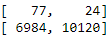
  - Calculated Precision, Recall and F1 Scores
    |Loan Status|Precision Score|Recall Score|F1 Score|
    |:---:      |:---:          |:---:       |:---:   |
    |High Risk  |1.09%          |76.24%      |2.15%   |
    |Low Risk   |99.76%         |59.17%      |74.28%  |
  - Imbalanced Classification Report:  
    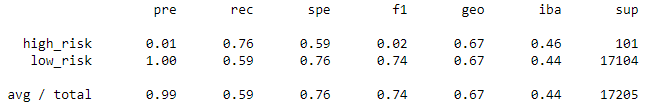
- **Smote Oversampling**
  - Balanced Accuracy Score: 66.24%
  - Confusion Matrix: 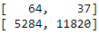
  - Calculated Precision, Recall and F1 Scores
    |Loan Status|Precision Score|Recall Score|F1 Score|
    |:---:      |:---:          |:---:       |:---:   |
    |High Risk  |1.20%          |63.37%      |2.35%   |
    |Low Risk   |99.69%         |69.11%      |81.63%  |
  - Imbalanced Classification Report:  
    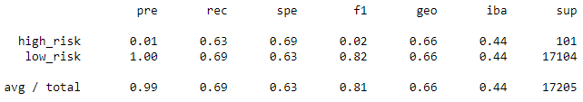
- **Cluster Centroids Undersampling**
  - Balanced Accuracy Score: 54.70%
  - Confusion Matrix: 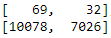
  - Calculated Precision, Recall and F1 Scores
    |Loan Status|Precision Score|Recall Score|F1 Score|
    |:---:      |:---:          |:---:       |:---:   |
    |High Risk  |0.68%          |68.32%      |1.35%   |
    |Low Risk   |99.55%         |41.08%      |58.16%  |
  - Imbalanced Classification Report:  
    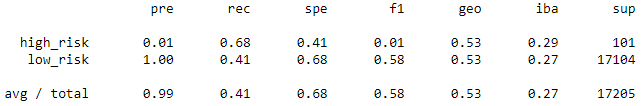
- **SMOTEEN Over and Under Sampling**
  - Balanced Accuracy Score: 64.47%
  - Confusion Matrix: 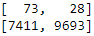
  - Calculated Precision, Recall and F1 Scores
    |Loan Status|Precision Score|Recall Score|F1 Score|
    |:---:      |:---:          |:---:       |:---:   |
    |High Risk  |0.98%          |72.28%      |1.92%   |
    |Low Risk   |99.71%         |56.67%      |72.27%  |
  - Imbalanced Classification Report:  
    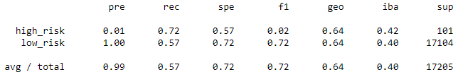
- **Balanced Random Forest Classifier**
  - Balanced Accuracy Score: 78.85%
  - Confusion Matrix: 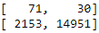
  - Calculated Precision, Recall and F1 Scores
    |Loan Status|Precision Score|Recall Score|F1 Score|
    |:---:      |:---:          |:---:       |:---:   |
    |High Risk  |3.19%          |70.30%      |6.11%   |
    |Low Risk   |99.80%         |87.41%      |93.20%  |
  - Imbalanced Classification Report:  
    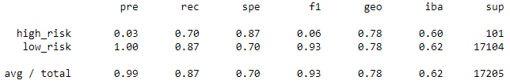
- **Easy Ensemble Adaboost Classifier**
  - Balanced Accuracy Score: 93.17%
  - Confusion Matrix: 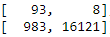
  - Calculated Precision, Recall and F1 Scores
    |Loan Status|Precision Score|Recall Score|F1 Score|
    |:---:      |:---:          |:---:       |:---:   |
    |High Risk  |8.64%          |92.08%      |15.80%  |
    |Low Risk   |99.95%         |94.25%      |97.02%  |
  - Imbalanced Classification Report:  
    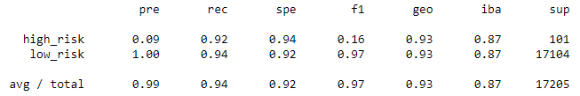

### Summary
The accuracy score is a quick indicator of how accurate each of the models was at predicting the loan status.  The results showed that only the Balanced Random Forest Classifier and the Easy Ensemble Adaboost Classifier had accuracy scores above 70%, with scores of 78.85% and 93.17% respectively.  If we only look at the accuracy score, it appears that the Easy Ensemble Adaboost Classifier is the best model for predicting loan status.  However, it is also important to look at the precision and recall scores of the model as well.

The precision score for the high risk loan category tells us what the chances are that a loan predicted as high risk, actually is high risk.  In all of the models, the precision score for the high risk category was very low (ranging from 0.68% to 8.64%), indicating that many loans predicted as high risk could actually be low risk customers for each of the models used.  This would be bad for business since many low risk customers would be denied their loans.  For example, for the Easy Ensenble Adaboost Classifier, which had the highest precision score for the high risk category, there were still 983 low risk loans that were predicted to be high risk and would therefore be denied.

The precision score for the low risk loan category tells us what the chances are that a loan predicted as low risk, actually is low risk.  In each of the models used in this analysis, the precision score for the low risk category was above 99%, indicating that nearly all loans predicted as low risk are actually low risk customers.

The recall score for the high risk loan category tells us what the chances are that a loan that is actually high risk, is predicted to be high risk.  For most of the models used in the analysis, the recall scores for high risk loans were between 65%-75%. This means that roughly 30% of high risk loans would be predicted as low risk and loans would be incorrectly given to high risk customers 30% of the time.  However, the Easy Ensemble Adaboost Classifier method had a recall score of 92.08% for the high risk category with only 8 of 101 high risk loans being predicted as low risk.

The recall socre for the low risk loan category tells us what the changes are that a loan that is actually low risk, is predicted to be low risk.  Again, most of the models used in this analysis resulted in low recall scores (below 70%) for the low risk category and were not were not accurate at predicting the loan status.  However, the Balanced Random Classifier resulted in a recall score of 87.41% and the Easy Ensemble Adaboost Classifier resulted in a recall score of 94.25%, meaning the models were quite accurate at predicting low risk loans.

After comparing the results of each of the methods used in the analysis, it becomes clear that the Easy Ensemble Adaboost Classifier is the best fit for the given dataset out of the methods analyzed, with 93% accuracy and high recall scores.  The precision score is quite low for high risk loans but when dealing with classifying credit risk, sensitivity (recall) is more important than precision.  In this case in particular, identifying all high risk loans accurately and ensuring they are denied outweighs the 5% of loans which are inaccurately predicted to be high risk, where low risk customers are denied.  There may be a better method available that better balances the sensitivity and precision for high risk loans, but based on the results of this analysis, I would recommend using the Easy Ensemble Adaboost Classifier to predict credit risk for this dataset.
